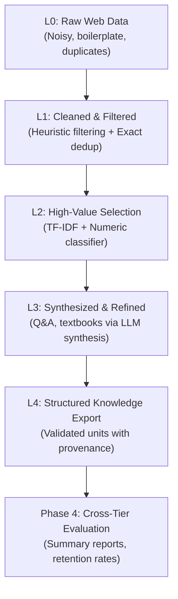

# Tiered Data Management: Architecture & Phases

This repository implements a lightweight, modular prototype reproducing the tiered data management framework from the research paper:
> **"Data Science and Technology Towards AGI Part I: Tiered Data Management"**  
> *arXiv:2602.09003* — [https://arxiv.org/abs/2602.09003](https://arxiv.org/abs/2602.09003)

---

## Conceptual Overview

The paper formalizes data management for large language model pre-training into distinct quality and density tiers:

---

## Phase Breakdown: Mapping Code Modules to Paper Concepts

### Phase 1: L1 Heuristic Filtering (Tier 1: Clean)
- **Paper Concept:** Section 2 — Initial hygiene, text extraction, exact deduplication, and heuristic cleaning to remove corrupted, low-information, and boilerplate web content.
- **Data Ingestion:**
  - `scripts/load_real_data.py`: Streams real web documents from `openbmb/Ultra-FineWeb` (Hugging Face) into `data/l0_raw/l0_real_sample.jsonl`.
  - `scripts/generate_l0_expanded.py`: Generates synthetic local substitute data (`data/l0_raw/l0_expanded_SUBSTITUTE.jsonl`) used automatically if network streaming times out or is offline.
  - `scripts/run_phase1.py`: Smart launcher that detects real data if present and executes L1 filtering.
- **Components:**
  - `src/utils/text_clean.py`: NFKC unicode normalization, whitespace stripping, boilerplate stripping.
  - `src/pipelines/l1_filter.py`: Heuristic thresholds (`min_chars`, `min_words`, `min_alpha_ratio`, `max_symbol_ratio`) and SHA-256 exact deduplication.
  - `src/pipelines/l1_run.py`: I/O orchestrator with automatic fallback chain (Real sample → Ultra-FineWeb / FineWeb streaming → local substitute).
  - `scripts/run_l1.py`: Standalone CLI runner.
- **Configs:** `configs/l1_tiny.yaml`, `configs/l1_expanded.yaml`.
- **Outputs:** `data/l1_filtered/` (Parquet + JSONL).

---

### Phase 2: L2 Model-Driven Selection (Tier 2: Selected)
- **Paper Concept:** Section 3 — Model-based selection to prioritize tokens rich in educational, scientific, and reasoning value over generic web text.
- **Components:**
  - `src/pipelines/l2_select.py`: 
    - Weak supervision demo labeling based on informational density heuristics (word count, alpha ratio, technical keywords).
    - Feature extraction combining TF-IDF n-grams (`TfidfVectorizer`) and scaled numeric text statistics (`StandardScaler`).
    - Preprocessing fit strictly on the training split to prevent data leakage.
    - Calibrated logistic regression scoring.
  - `src/pipelines/l2_run.py`: Scores all records, saves full score distribution to `data/l2_scores/`, and filters top candidates into `data/l2_selected/`.
  - `scripts/run_l2.py`: CLI runner with rich summary table.
- **Configs:** `configs/l2_tiny.yaml`, `configs/l2_expanded.yaml`.
- **Outputs:** `data/l2_scores/` and `data/l2_selected/` (Parquet + JSONL).

---

### Phase 3: L3 LLM Refinement & Synthesis (Tier 3: Refined)
- **Paper Concept:** Section 3.3 — Synthetic data generation and transformation. Using LLMs to transform unstructured web text into high-density educational formats (Q&A pairs, textbook chapters).
- **Components:**
  - `src/utils/llm_provider.py`: Abstract `LLMProvider` interface and deterministic offline `MockLLMProvider`. Requires zero API keys, GPUs, or external network calls.
  - `src/pipelines/l3_refine.py`: Orchestrates doc-by-doc synthesis, attaching provenance metadata (`generated_by: mock_llm`).
  - `scripts/run_l3.py`: CLI runner with summary metrics.
- **Configs:** `configs/l3_tiny.yaml`.
- **Outputs:** `data/l3_refined/` (Parquet + JSONL).

---

### Phase 3.5: L4 Organized Knowledge Export (Tier 4: Organized)
- **Paper Concept:** Section 3.4 — Knowledge unit organization, quality gates, and structured knowledge management for production training.
- **Components:**
  - `src/pipelines/l4_export.py`: Validates non-empty fields, structural markdown headers, question/answer length gates, and attaches ISO-8601 UTC timestamps.
  - `scripts/run_l4_export.py`: Standalone CLI runner.
- **Configs:** `configs/l4_tiny.yaml`.
- **Outputs:** `data/l4_organized/` (Parquet + JSONL).

---

### Phase 4: Evaluation & Comparison
- **Paper Concept:** Section 4 — Multi-tier comparative evaluation, measuring quality progression, duplicate reduction, and token retention rates across tiers.
- **Components:**
  - `src/evaluation/metrics.py`: Statistical computation of document counts, character/word distributions, alpha/symbol ratios, duplicate rates, and transition rates.
  - `scripts/run_evaluation.py`: Generates Markdown, CSV, and JSON reports with prominent source tracking.
- **Outputs:**
  - `reports/pipeline_summary.md`
  - `reports/tier_stats.csv`
  - `reports/tier_stats.json`

---

### Phase 5: Colab Integration & Reproducibility
- **Paper Concept:** Reproducible workflows across cloud and local compute environments.
- **Notebooks:**
  - `colab/run_all.ipynb`: Full end-to-end execution notebook with smart launcher, visual reporting, and optional extension blocks.
  - `colab/phase2_colab.ipynb`: Dedicated Phase 2 exploration notebook for model-based selection.

---

## Data-Model Co-Evolution: Optional Extensions (A, B, C)

The paper *arXiv:2602.09003* emphasizes that data management and model architectures do not evolve in isolation; they are deeply coupled. As model capabilities advance, they both **require** higher-density structured data (co-evolution Part I) and **enable** higher-quality synthetic transformations (co-evolution Part II).

### Extension A: Real LLM Synthesis via Google Gemini (`src/utils/llm_provider.py`)
- **Paper Concept:** Section 3.3 — Generative Data Transformation & Model Feedback Loops.
- **Role:** Rather than relying purely on deterministic rules, production systems use frontier LLMs to rewrite, condense, and generate grounded Q&A pairs and textbook explanations. `GeminiLLMProvider` connects the pipeline to a real generative model (`gemini-1.5-flash`), formatting structured JSON with automated fallback to `MockLLMProvider`.

### Extension B: FastText Quality Classifier (`src/pipelines/l2_fasttext.py`)
- **Paper Concept:** Section 3.1 & 3.2 — Scalable Linear Classifiers in Massive Web Pipelines.
- **Role:** In multi-billion-token pipelines (like FineWeb and CCNet), deep neural classifiers are computationally prohibitive for initial token triage. FastText's word n-gram and subword embeddings offer an optimal balance of throughput (>100k docs/sec) and semantic precision for educational filtering.

### Extension C: Micro-Training Downstream Evaluation (`scripts/run_microtrain.py`)
- **Paper Concept:** Section 4.3 — Downstream Training Dynamics & Perplexity Trajectories.
- **Role:** The true validation of a tiered data management system is not simply retention counts, but downstream sample efficiency. Extension C trains a 125M parameter causal LM (`gpt2`) on L1 (heuristic cleaned) vs. L4 (structured knowledge units) and benchmarks validation perplexity, empirically demonstrating that systematic data organization reduces token entropy and improves model learning.

