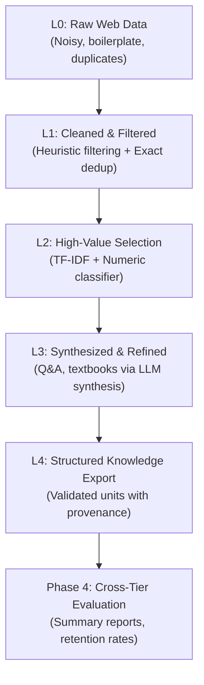

# Tiered Data Management: Architecture & Phases

This repository implements a lightweight, modular prototype reproducing the tiered data management framework from the research paper:
> **"Data Science and Technology Towards AGI Part I: Tiered Data Management"**  
> *arXiv:2602.09003*

---

## Conceptual Overview

The paper formalizes data management for large language model pre-training into distinct quality and density tiers:

---

## Phase Breakdown

### Phase 1: L1 Heuristic Filtering (Tier 1: Clean)
- **Objective:** Eliminate corrupted, truncated, symbol-heavy, boilerplate, or exact-duplicate web documents.
- **Components:**
  - `src/utils/text_clean.py`: NFKC unicode normalization, whitespace stripping, boilerplate stripping.
  - `src/pipelines/l1_filter.py`: Heuristic thresholds (`min_chars`, `min_words`, `min_alpha_ratio`, `max_symbol_ratio`) and SHA-256 exact deduplication.
  - `src/pipelines/l1_run.py`: I/O orchestrator with fallback chain (Ultra-FineWeb / FineWeb streaming → local substitute).
  - `scripts/run_l1.py`: CLI entry point.
- **Configs:** `configs/l1_tiny.yaml`, `configs/l1_expanded.yaml`.
- **Outputs:** `data/l1_filtered/` (Parquet + JSONL).

---

### Phase 2: L2 Model-Driven Selection (Tier 2: Selected)
- **Objective:** Discriminate between general clean web text and high-density, informative educational tokens.
- **Components:**
  - `src/pipelines/l2_select.py`: 
    - Weak supervision demo labeling based on informational density heuristics.
    - Feature extraction combining TF-IDF n-grams (`TfidfVectorizer`) and scaled text statistics (`StandardScaler`).
    - Preprocessing fit strictly on the training split to prevent data leakage.
    - Calibrated logistic regression scoring.
  - `src/pipelines/l2_run.py`: Scores all records, saves full score distribution to `data/l2_scores/`, and filters top candidates into `data/l2_selected/`.
  - `scripts/run_l2.py`: CLI runner with summary table.
- **Configs:** `configs/l2_tiny.yaml`, `configs/l2_expanded.yaml`.
- **Outputs:** `data/l2_scores/` and `data/l2_selected/`.

---

### Phase 3: L3 LLM Refinement and Synthesis (Tier 3: Refined)
- **Objective:** Synthesize raw selected text into structured educational assets: clean articles, grounded Q&A pairs, and textbook chapters.
- **Components:**
  - `src/utils/llm_provider.py`: Abstract `LLMProvider` interface and deterministic offline `MockLLMProvider`. Requires zero API keys, GPUs, or external network calls.
  - `src/pipelines/l3_refine.py`: Orchestrates doc-by-doc synthesis, attaching provenance metadata (`generated_by: mock_llm`).
  - `scripts/run_l3.py`: CLI runner.
- **Configs:** `configs/l3_tiny.yaml`.
- **Outputs:** `data/l3_refined/` (Parquet + JSONL).

---

### Optional Phase 3.5: L4 Organized Knowledge Export
- **Objective:** Apply strict quality gates and export structured, validated training units with audit metadata.
- **Components:**
  - `src/pipelines/l4_export.py`: Validates non-empty fields, structural markdown headers, question/answer length gates, and attaches ISO-8601 UTC timestamps.
  - `scripts/run_l4_export.py`: CLI runner.
- **Configs:** `configs/l4_tiny.yaml`.
- **Outputs:** `data/l4_organized/`.

---

### Phase 4: Evaluation and Comparison
- **Objective:** Measure quality progression, retention ratios, and token-level shifts across tiers.
- **Components:**
  - `src/evaluation/metrics.py`: Statistical computation of document counts, character/word distributions, alpha/symbol ratios, duplicate rates, and transition rates.
  - `scripts/run_evaluation.py`: Generates Markdown, CSV, and JSON reports.
- **Outputs:**
  - `reports/pipeline_summary.md`
  - `reports/tier_stats.csv`
  - `reports/tier_stats.json`

---

### Phase 5: Colab Integration
- **Objective:** Enable one-click reproduction in Google Colab / Linux environments.
- **Notebooks:**
  - `colab/run_all.ipynb`: Full 9-cell end-to-end execution notebook.
  - `colab/phase2_colab.ipynb`: Dedicated Phase 2 execution notebook.
